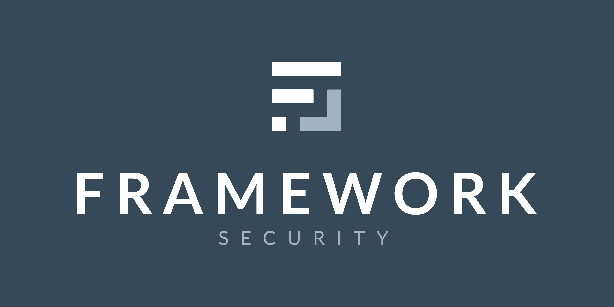

<!-- PROJECT LOGO -->
<link href="https://fonts.googleapis.com/css2?family=Lato&display=swap" rel="stylesheet">

  

<!-- PROJECT TITLE -->
<h1 align="center" style="font-family:Lato;">
  <b>Minerva Insights</b>
</h1>

  The reporting solution for security professionals.  
   
  <a href="https://www.frameworksecurity.com"><strong>Visit Framework Security »</strong></a>
   
   
  <a href="https://github.com/Framework-Security/minerva-community/issues">Report Bug</a>
  ·
  <a href="https://github.com/Framework-Security/minerva-community/issues">Request Feature</a>

---

Minerva Insights is a web-based, open-source reporting platform designed for security professionals. Instead of starting from scratch for every engagement, pentesters can build and maintain a finding database specific to each client. 

Every finding includes:

- Technical description
- Business impact
- Remediation guidance
- References (CVE, CWE, OWASP, etc.)

---

## Running Minerva Insights

 Minerva is built on top of the wkhtmltopdf document rendering engine, and requires a version that has been patched with QtWebKit. That can be found on the <a href="https://github.com/wkhtmltopdf/packaging/releases">wkhtmltopdf github.</a>  Once installed, use `pip install -r requirements.txt` to install the needed dependencies.  From there, PDF's can begin being generated. Modify the generate.py file to insert your custom content, including your own toolkits and vulnerabilities!   If you have any questions or inquiries, feel free to <a href="https://www.frameworksecurity.com">reach out</a>, <a href="https://github.com/Framework-Security/minerva-community/issues">open an issue</a> or create a pull request.

